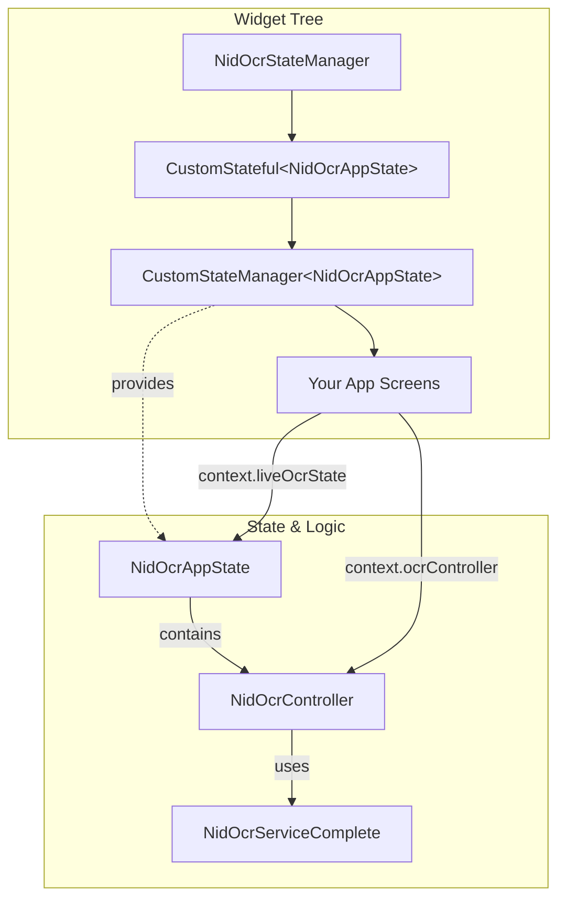
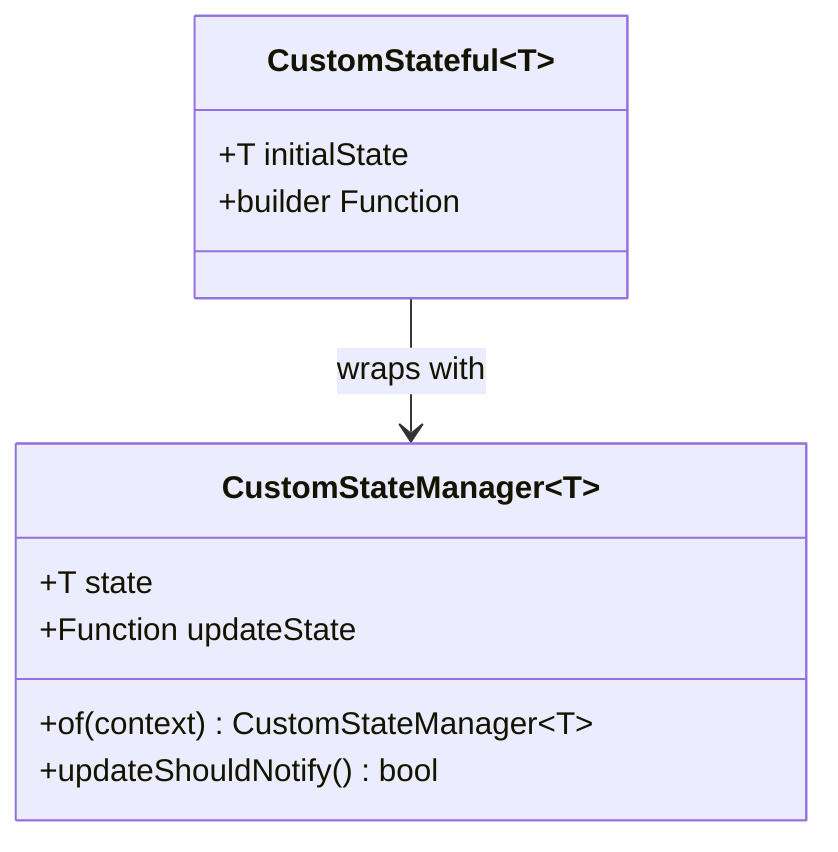
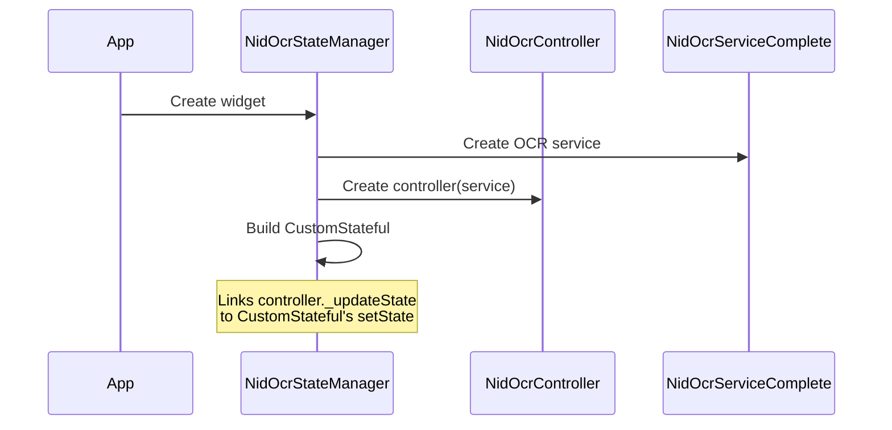
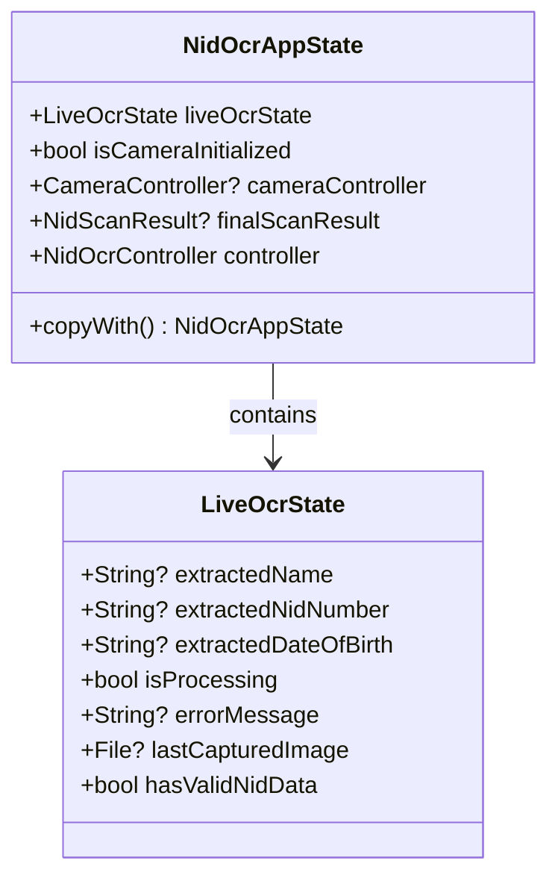
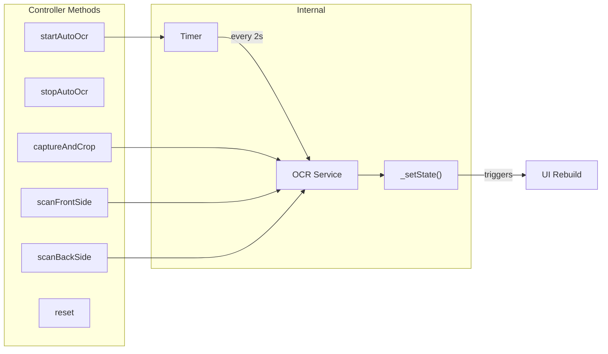
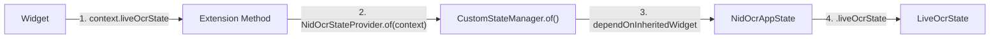
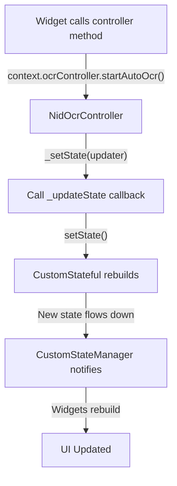
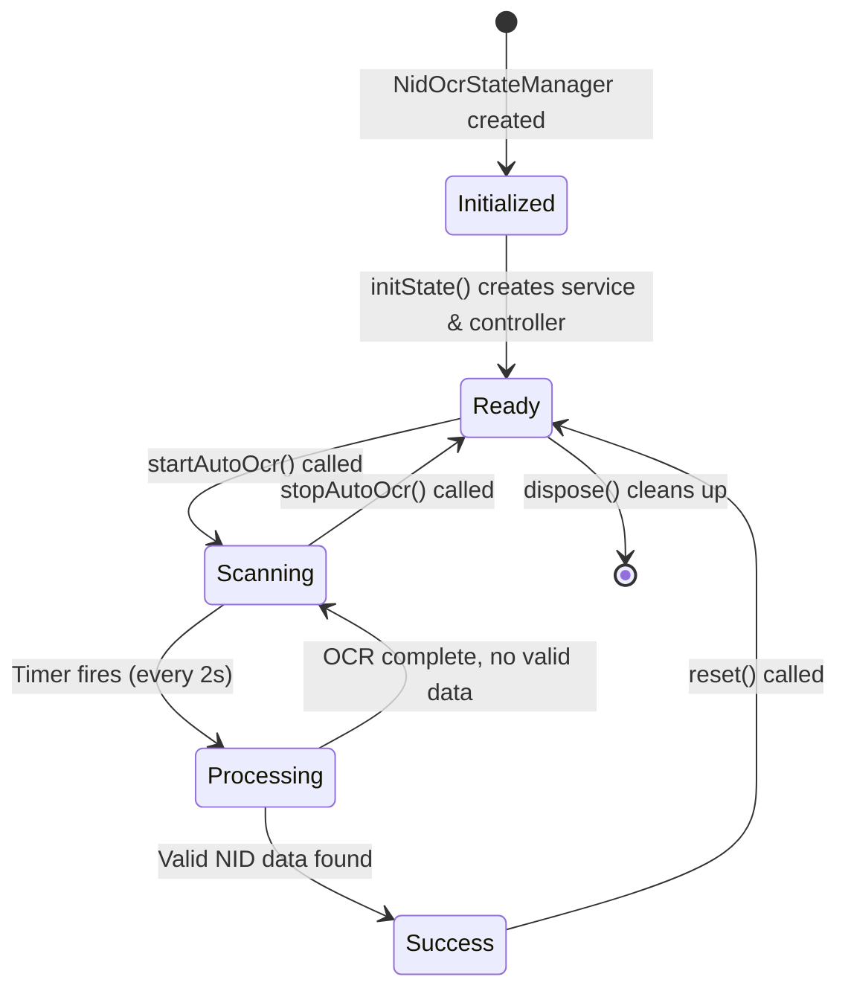
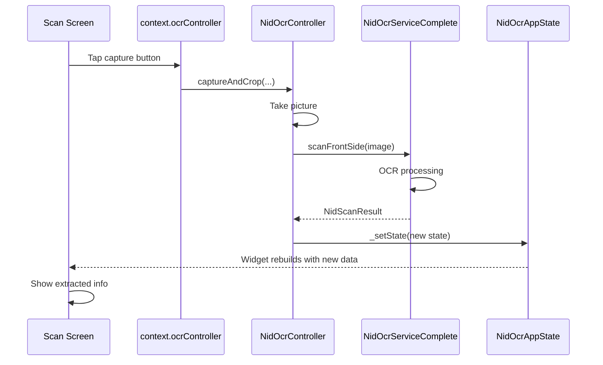

# NID OCR State Management Walkthrough

A comprehensive guide to understanding the custom InheritedWidget-based state management system.

---

## Architecture at a Glance



---

## The Four Core Components

### 1. CustomStateManager (The Foundation)

The generic `InheritedWidget` that makes state available to descendants.



| Component | Purpose |
|-----------|---------|
| `CustomStateManager<T>` | InheritedWidget that holds and provides state |
| `CustomStateful<T>` | StatefulWidget that manages state updates |

---

### 2. NidOcrStateManager (The Entry Point)

Wraps your app and initializes everything.



**Key insight**: The magic happens at line 46-47:
```dart
_controller._updateState = setState;
_controller._currentState = state;
```
This bridges the controller to trigger UI rebuilds!

---

### 3. NidOcrAppState (The State Container)

Holds all OCR-related state in one immutable object.



---

### 4. NidOcrController (The Business Logic)

Contains all OCR operations and state mutations.



---

## How Data Flows

### Reading State



### Updating State



---

## Lifecycle Management



---

## Accessing State - Quick Reference

### Using Extensions (Recommended)

```dart
// Get the current OCR state
final state = context.liveOcrState;

// Get the controller
final controller = context.ocrController;

// Check camera status
final isReady = context.isCameraInitialized;
```

### Using Builder Widget

```dart
LiveOcrStateBuilder(
  builder: (context, state, controller) {
    return Column(
      children: [
        Text('Name: ${state.extractedName ?? "Scanning..."}'),
        Text('NID: ${state.extractedNidNumber ?? "---"}'),
        if (state.isProcessing) CircularProgressIndicator(),
      ],
    );
  },
)
```

---

## File Structure

```
state/
├── custom_state_manager.dart    # Generic InheritedWidget foundation
├── nid_ocr_state_manager.dart   # Main entry point + controller + state
├── nid_ocr_state_provider.dart  # Static helper for state access
├── state_extensions.dart        # Context extensions & builders
└── README.md                    # Migration guide
```

---

## Key Takeaways

| Concept | Implementation |
|---------|---------------|
| **State lives in** | `NidOcrAppState` (immutable) |
| **Logic lives in** | `NidOcrController` |
| **State access** | `context.liveOcrState` or `LiveOcrStateBuilder` |
| **State updates** | Controller calls `_setState()` → UI rebuilds |
| **No external deps** | Pure Flutter `InheritedWidget` |

---

## Complete Data Flow Example


